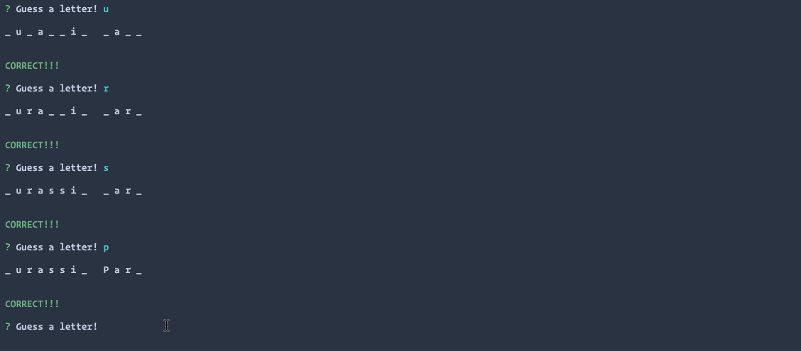

# Constructor Word Guess:

## Advanced Javascript Assignment

### Overview

In this **optional** unit assignment, I created a Word Guess command-line game using constructor functions based on the following model:

## Criteria

The completed game meets the following criteria:

1. The completed game is able to receive user input using the `inquirer` npm packages.

2. The solution has, at minimum, three files:

- **Letter.js**: Contains a constructor, Letter. This constructor is able to either display an underlying character or a blank placeholder (such as an underscore), depending on whether or not the user has guessed the letter. That means the constructor defines:

  - A string value to store the underlying character for the letter

  - A boolean value that stores whether that letter has been guessed yet

  - A function that returns the underlying character if the letter has been guessed, or a placeholder (underscore) if the letter has not been guessed

  - A function that takes a character as an argument and checks it against the underlying character, updating the stored boolean value to true if it was guessed correctly

* **Word.js**: Contains a constructor, Word that depends on the Letter constructor. This is used to create an object representing the current word the user is attempting to guess. That means the constructor defines:

  - An array of `new` Letter objects representing the letters of the underlying word

  - A function that returns a string representing the word. This should call the function on each letter object (the first function defined in `Letter.js`) that displays the character or an underscore and concatenate those together.

  - A function that takes a character as an argument and calls the guess function on each letter object (the second function defined in `Letter.js`)

* **index.js**: This file contains the logic for the course of the game, which depends on `Word.js` and:

  - Randomly selects a word and uses the `Word` constructor to store it

  - Prompts the user for each guess and keeps track of the user's remaining guesses

## [Check out the demo here](https://youtu.be/JlaooGbHD7k)!
